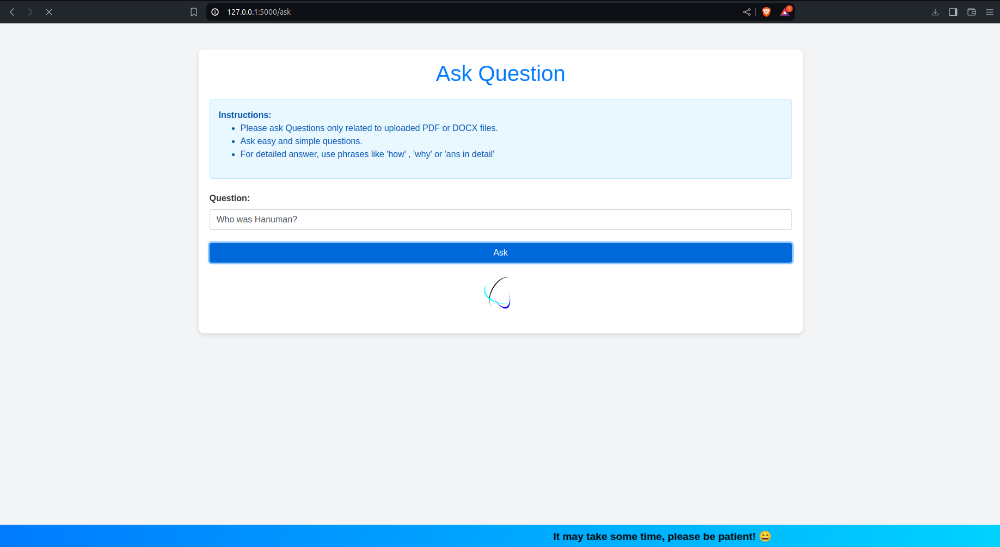
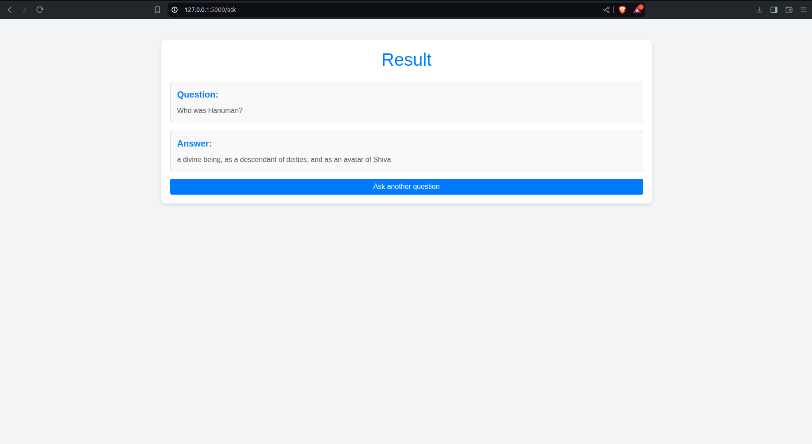

# Document-Question-Answering-App

This repository contains the code for a web application designed to handle document uploads (PDF or DOCX) and leverage the power of large language models (LLMs) to provide question and answer functionality on the uploaded documents.

## Table of Contents

- [Features](#features)
- [Prerequisites](#prerequisites)
- [Installation](#installation)
- [Set-up](#set-up)
- [Run](#run)
- [Project Structure](#project-structure)
- [Output Structure](#output-structure)
- [Demo](#demo)
- [Contributing](#contributing)

## Features

- Upload PDF or DOCX documents
- Extract text from uploaded documents
- Leverage LLMs to answer questions based on the document content
- Web interface (using Flask) for document upload and interaction

## Prerequisites

Before you begin, ensure you have the following installed:

- [Python 3.12](https://www.python.org/downloads/ "Click here for download")
- Pycharm or any other IDE of your choice ([Pycharm](https://beginnersbook.com/2018/01/python-install-pycharm-windows-mac-linux/ "Click here for installation instructions") is recommended)
- [Git CLI](https://kinsta.com/knowledgebase/install-git/ "Click here for installation instructions") for tracking changes

## Installation

1. Make sure you have installed all prerequisites.

2. Clone the repository using the command `git clone` or download the zip file and extract it.

3. Open the project in any IDE (PyCharm is preferred).

## Set-Up

1. Create a virtual environment:

```bash
python -m venv venv
```
2. Activate the virtual environment:

- On Windows

```bash
venv\Scripts\activate
```

- On MacOS/Linux:

```bash
source venv/bin/activate
```
3. Install dependencies from the requirements.txt file:

```python
pip install -r requirements.txt
```

Now, the setup is complete and ready to run.


## Run

You can run the Flask application using either of the following methods:

1. **Simply as a Flask app**:
   Run the application using the command:

   ```bash
   python flask_app/app.py
   ```
2. As a one-click executable:
Create an executable file using the following command:
    ```bash
    pyinstaller flask_app/run_app.spec
    ```
    An executable will be created inside a folder named `dist` at the root level. Just run the executable and your app will start.


## Project Structure

<details>
<summary> Project Structure </summary>

```plaintext
├── app.ipynb
├── flask_app
│   ├── app.py
│   ├── build
│   ├── dist
│   ├── run_app.py
│   ├── run_app.spec
│   ├── templates
│   │   ├── ask.html
│   │   ├── index.html
│   │   └── result.html
│   └── uploads
├── llmmodel.ipynb
└── requirements.txt
```
</details>


## Output Structure
Upon successful execution of the project, it generates the following directory structure inside the `flask_app/uploads` directory.

```plaintext
├── flask_app
│   ├── uploads
│   │   ├── <uploaded_files>
```
Description:

- uploads: This directory contains the uploaded document files.

## Demo
Below are some images showcasing the application's interface and functionality.

### Document Upload


### Ask Question


### Question and Answer


## Contributing

1. Fork the repository.
2. Create a new branch using git checkout -b feature/<feature-name>.
3. Commit your change using git commit.
4. Push to the branch using git push origin feature/<feature-name>.
5. Submit a pull request.